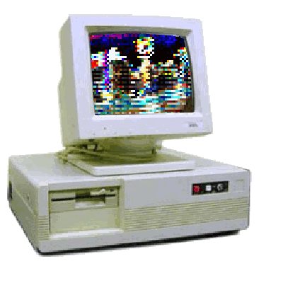

# Hi there 👋

## About me
I’m Antonio, a passionate backend developer/software engineer with a flair for building clean, maintainable architectures.  
I kicked off my career working with Java and SQL, and over the past months I’ve been fully immersed in Go.

**Current focus:**
- Creating apps with **Spring Boot** and **JPA/Hibernate**
- Diving deep into **Golang**
- Exploring **ports and services architecture**
- Learning **Python**

  

## Tech Stack 💻
Over the past years I've been coding with these languages:

- **Backend:**     

- **Databases:**    

- **Frontend:**      

- **Shells:** 

- **Frameworks and libraries**    

## Stats

  
  

## Contact

Don’t hesitate—get in touch!

- ✉️ Email: [antort1988@gmail.com](mailto:antort1988l@gmail.com)  
